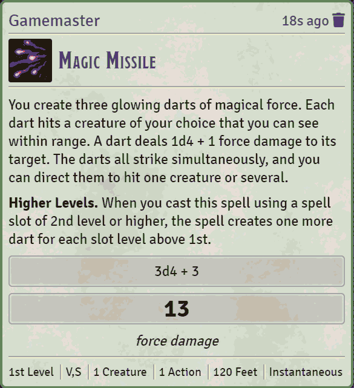
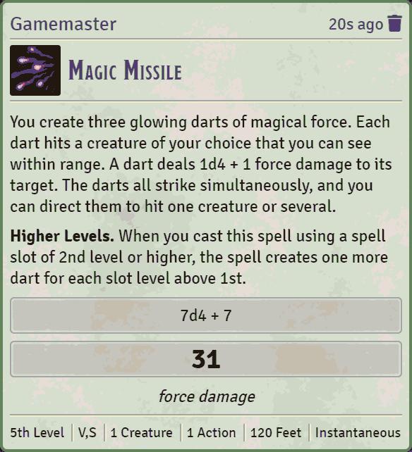
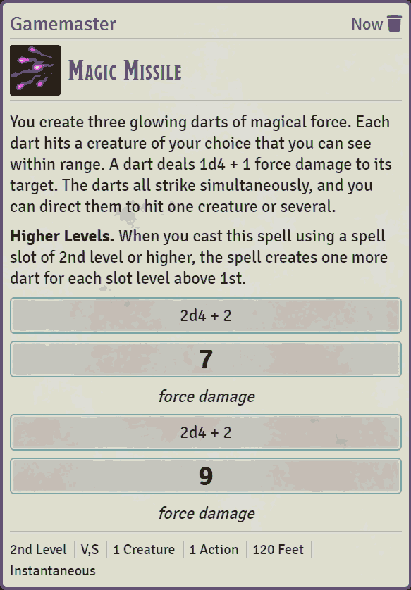

# Foundry VTT - Magic Missile

A simple chat macro to cast the 5e spell Magic Missile.

## Installation

In the setup screen, use the URL https://raw.githubusercontent.com/dprothero/fvtt-module-magic-missile/master/module.json to install the module.

## New Chat Command

`/mm (or /magicmissile) [spell level]` - casts Magic Missile at the desired level (defaults to level 1).

### Examples

`/mm` - Casts Magic Missile at level 1:

***

`/mm 5` - Casts Magic Missile at level 5:

### Advanced usage for split targets

If you want a portion of the missiles to go to different targets, just add the number(s) after the spell level...

`/mm <spell level> [target_1_missiles, ..., target_n_missiles]`

For example, if you cast Magic Missile at 2nd level, you will have four missiles. To send two of those missiles to one target and two to another target, use the following command:

`/mm 2 2 2`

You can actually leave off the last 2 since we can just send however many missiles are left to the last target, so the following command is equivalent:

`/mm 2 2`

## Release Notes

- v0.2.0: Initial release.
- v0.3.0: Added image and full description of the spell, pulling from the 5e spell compendium.
- v0.4.0: Added ability to split missiles to multiple targets.
- v0.4.1: Tested with Foundry VTT 0.7.6.